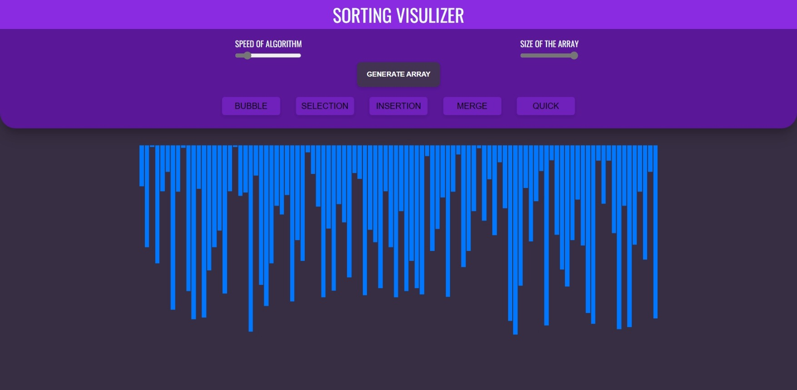
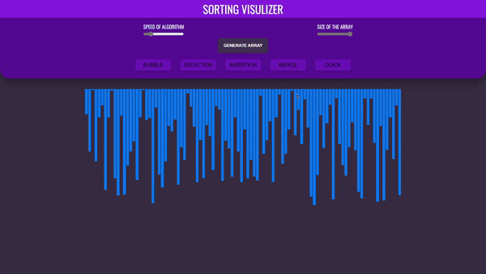

# Sorting Visualizer :bar_chart:

This is a very basic sorting visualizer project which is made using **Vanilla JavaScript**. It consist of all the basic sorting algorithms.

**Sorting Algorithms**
1. Bubble Sort
2. Insertion Sort
3. Selection Sort
4. Merge Sort
5. Quick Sort

#### :star: Application UI

#### :star: Live Demo

***
:heart::smile:**Thank you for your visit** :smile::heart:
Do give star in this repository :star:

### Created and written by [Arkajit Roy](https://github.com/arkajitroy) :point_left: